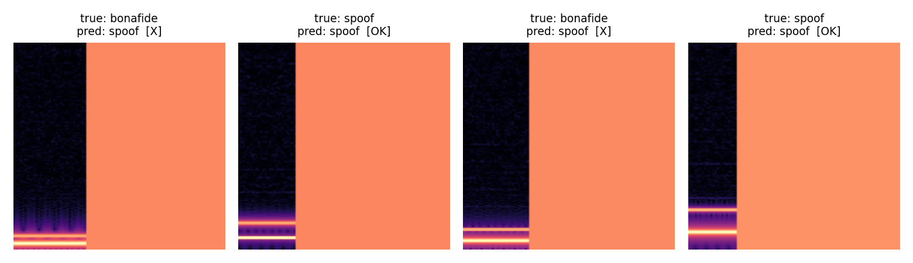
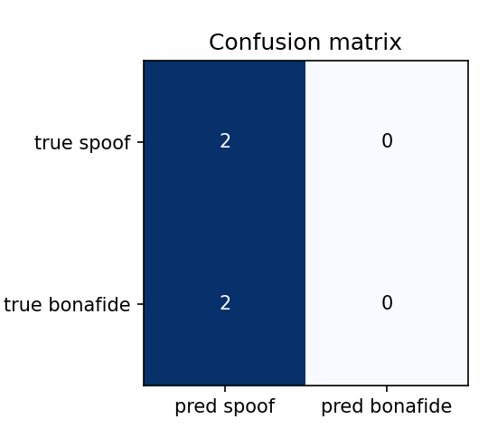

# Speech Deepfake Detection

DSCI 410L project milestone repository.

## Project Overview

This project investigates speech deepfake detection. The goal is to classify an audio clip as either bonafide human speech or spoofed/generated speech. The model input is unstructured speech audio converted into log-spectrogram features.

## Data Overview

The full project will use ASVspoof Logical Access speech data.

- ASVspoof 2021 LA speech archive: https://zenodo.org/records/4837263
- ASVspoof 2021 LA keys/metadata: https://www.asvspoof.org/asvspoof2021/LA-keys-full.tar.gz
- ASVspoof challenge site: https://www.asvspoof.org/index2021.html


Low-quality and phone-quality audio will come from ASVspoof 2021 LA codec/transmission conditions. The metadata fields in this repo make it possible to compare model performance across these conditions.


## Methods Overview

The package includes:

- `pm.dataset.dataloader`: ASVspoof protocol parser, WAV/FLAC audio loader, and PyTorch `DataLoader`
- `pm.model`: a small CNN for log-spectrogram inputs
- `pm.train_model`: a training loop for checking that the project is trainable

## Results

In Progress

## Conclusion

In Progress

## Installation

```bash
pip install .
```

## Package Use


## Repository Layout

- `pm/model/model.py` — the model: a compact 2-D CNN (`AudioClassifier`).
- `pm/dataset/dataloader.py` — `ASVspoofAudioDataset`, the protocol parser, audio
  loader, and spectrogram transform (the non-standard data loading).
- `pm/train_model.py` — the training script (plain PyTorch, CLI).
- `notebooks/data_demo.ipynb` — examples drawn from the dataset class.
- `notebooks/evaluation.ipynb` — loads trained weights, predicts, and produces the
  metrics and plots below.
- `scripts/train_talapas.slurm` — example SLURM job for the cluster.

## How to Train the Model

Install the package, then run the training script.

```bash
pip install .

# 1) Quick sanity run on the four bundled clips (no download needed)
python -m pm.train_model --example --epochs 15 --batch-size 4 --val-frac 0.0

# 2) Full run on the extracted ASVspoof 2021 LA eval set (on Talapas)
python -m pm.train_model \
    --data-dir pm/dataset/ASVspoof2021_LA_eval/flac \
    --metadata pm/dataset/ASVspoof2021_LA_eval/trial_metadata.txt \
    --audio-ext .flac \
    --epochs 20 --batch-size 64 --balance \
    --out pm/model/weights/model.pt
```

`--balance` applies inverse-frequency class weights to offset ASVspoof's heavy
spoof-to-bonafide imbalance. Training writes a `state_dict` to
`pm/model/weights/model.pt`. On Talapas, submit the batch job with
`sbatch scripts/train_talapas.slurm` (set your `--account`/PIRG inside the file first).

## Results

**Proposed metrics.** The primary metric is **Equal Error Rate (EER)** — the operating
point where the false-alarm rate (a real voice flagged as fake) equals the false-reject
rate (a fake voice missed) — because EER is the standard ASVspoof score and is
threshold-independent. Alongside it I report **accuracy, precision, recall, and F1**
with spoof as the positive class. `compute_eer()` lives in `pm/train_model.py` and is
imported by the evaluation notebook so training and evaluation use one definition.

**Prediction visualization.** `notebooks/evaluation.ipynb` produces a confusion matrix
and a per-clip panel of log-spectrograms annotated with true vs. predicted labels:




The figures above are a **pipeline sanity-check on the four bundled clips**, not the
reported test result — on four toy examples the model simply learns to call everything
`spoof`. The full held-out ASVspoof eval numbers are produced by re-running the
evaluation notebook against the cluster-trained weights, and go in this table:

| Metric    | Value (full ASVspoof eval) |
| --------- | -------------------------- |
| EER       | _fill in after Talapas run_ |
| Accuracy  | _fill in_ |
| Precision | _fill in_ |
| Recall    | _fill in_ |
| F1        | _fill in_ |

## Limitations and Use

This is a deliberately small model on a fixed, short audio window, so it captures local
spectral artifacts of synthesis but not long-range prosody, and it only sees the first
~1 second of each clip. It is trained and evaluated on ASVspoof 2021 LA, so it learns
the specific synthesis systems and channel conditions in that corpus; performance on
unseen attack types or real-world recordings will be lower, and EER typically rises
sharply under phone codecs. The detector outputs a probability, not proof — it is meant
as a screening aid (prioritizing clips for human review or layering with other signals),
**not** as a sole basis for accusing a recording of being fake or making automated
high-stakes decisions about a person. It should not be relied on for forensic or legal
conclusions.

## Data and Weights Locations

- **Data (Talapas):** download to `pm/dataset/ASVspoof2021_LA_eval.tar.gz`, extract to
  `pm/dataset/ASVspoof2021_LA_eval/` (raw archives and `flac/` are git-ignored). Full
  source links and extraction commands are in `pm/dataset/data.md`.
- **Trained weights (Talapas):** `pm/model/weights/model.pt`, written by
  `pm/train_model.py`. Weights are git-ignored (too large to version); the folder is
  kept via `.gitkeep`.
- **Bundled demo data (in repo):** `assets/example_audio/*.wav` +
  `assets/trial_metadata.txt`.

## Installation

```bash
pip install .
```
