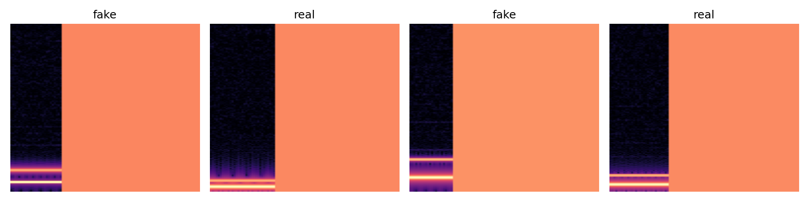
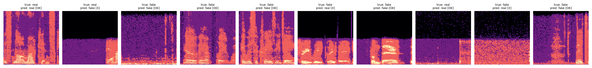
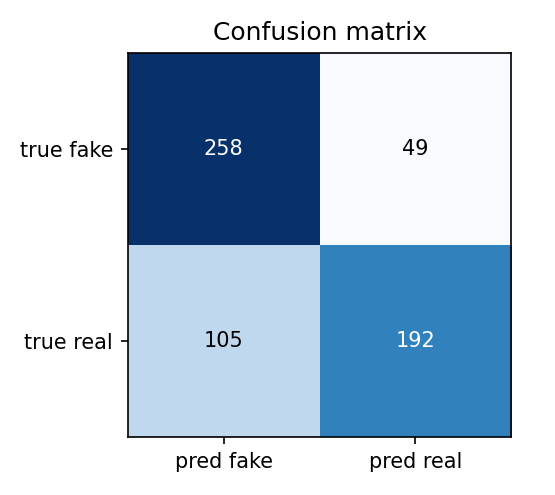

# Speech Deepfake Detection

## Project Purpose

This project is a small speech deepfake detector. The goal is to take a short speech clip and predict whether it is `real` human speech or `fake` generated speech. I picked this topic because generated voices are getting easier to make, but it is still hard for people to know when an audio clip has been edited or created by a model. This project is not a full forensic system. It is a class project that tests whether a small neural network can learn useful patterns from audio spectrograms.

The model turns each audio file into a log-spectrogram. A spectrogram is a picture of how the frequency content of the audio changes over time. The model then treats that spectrogram like a small image and classifies it with a simple convolutional neural network.

## Dataset

The full dataset is the ASVspoof 2021 Logical Access evaluation set. It contains real speech and many fake speech samples made with different text-to-speech and voice conversion systems. The project uses the challenge metadata file to connect each audio file to its label.

The dataset code is in `pm/dataset/dataloader.py`. It reads an ASVspoof-style `trial_metadata.txt` file, loads WAV or FLAC audio, converts the audio to a log-spectrogram, pads or crops it to a fixed length, and returns PyTorch tensors. The dataloader maps the official dataset labels into the project labels: `real` and `fake`.

The repo includes four tiny WAV files in `assets/example_audio/` and `assets/trial_metadata.txt` so the notebooks and training script can run immediately after cloning. The full audio archive is too large for normal GitHub storage, so it is not committed. After cloning on Talapas, put the data at the paths below.

Data paths:

- Full audio archive: `pm/dataset/ASVspoof2021_LA_eval.tar.gz`
- Full keys archive: `pm/dataset/LA-keys-full.tar.gz`
- Extracted audio folder: `pm/dataset/ASVspoof2021_LA_eval/flac/`
- Metadata file used for training: `pm/dataset/ASVspoof2021_LA_eval/trial_metadata.txt`
- Demo audio in the repo: `assets/example_audio/`

## Model

The model code is in `pm/model/model.py`. It is a compact CNN with two convolution layers, ReLU activations, pooling, and a final linear layer for the two classes. I used this model because it is simple enough to train quickly, but it still matches the shape of the problem: audio becomes a spectrogram, and the CNN looks for local frequency-time patterns that may separate real and fake speech.



## Training

Install the project from the repo root:

```bash
pip install .
```

Run a quick check on the four demo clips:

```bash
python -m pm.train_model --example --epochs 5 --batch-size 4 --val-frac 0.0
```

Run training interactively on Talapas after the full dataset is extracted:

```bash
python -m pm.train_model \
  --data-dir pm/dataset/ASVspoof2021_LA_eval/flac \
  --metadata pm/dataset/ASVspoof2021_LA_eval/trial_metadata.txt \
  --audio-ext .flac \
  --epochs 15 \
  --batch-size 64 \
  --balance \
  --out pm/model/weights/model.pt
```

The trained weights path is:

```text
pm/model/weights/model.pt
```

Weights are ignored by Git because real trained checkpoints can get large. After training on Talapas, keep or copy the weights at that path and point the evaluation notebook to it.

## Results

For the quick local result included in this repo, I trained the same model on a small balanced subset made from the local ASVspoof archives. After filtering unreadable local files, the subset had 604 usable clips. I used an 80/20 train/held-out split, so the numbers below are from 120 held-out clips. The metrics below are for compressed 2-bit spectrograms

| Metric | Value |
| --- | ---: |
| Equal Error Rate | 0.24 |
| Accuracy | 0.74 |
| Precision | 0.71 |
| Recall | 0.84 |
| F1 | 0.77 |

The main metric is Equal Error Rate because it is commonly used for speech fake detection. I also report accuracy, precision, recall, and F1 because they are easier to explain in the presentation. For this project, `fake` is treated as the positive class.





## Notebooks

- `notebooks/data_demo.ipynb` shows examples from the dataset class and saves the spectrogram image used above.
- `notebooks/evaluation.ipynb` loads trained weights, predicts labels, calculates metrics, and saves the result plots in `assets/eval_figures/`.

## Limitations and Use

This model is intentionally small. It only looks at a short fixed window of each audio clip, so it may miss longer speech patterns. It is also trained on ASVspoof-style data, so it may not work as well on phone recordings, noisy real-world clips, or fake voices made by newer systems. The local result is only a small subset result. The full Talapas run should be used for the final presentation results.

This detector should be used as a screening tool, not as proof that a recording is fake. A real system would need more data, stronger evaluation, and checks across different recording conditions before it could be trusted outside a class project.
